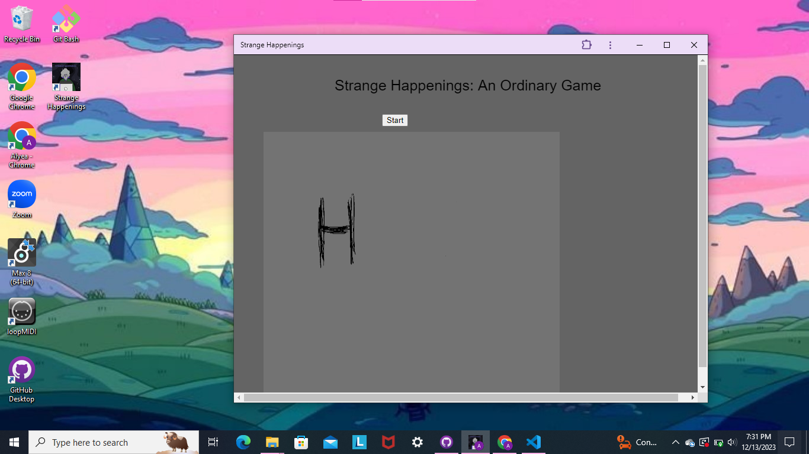
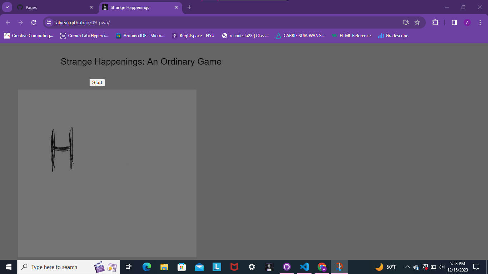

## 09-pwa
 

# Strange Happenings  

Description: A short choose your own adventure game where strange things happen in your apartment. 

### Process
This link doesn't work: 
http://143.244.215.52:3000/ 

This link works on my laptop but not on my phone: 
http://127.0.0.1:5500/

But I can install it on my laptop but only on local host for now: 
 

I have been having some issues with deploying the droplet on digital ocean. The status doesn't detect any errors yet the link won't work. I don't know if it's because the app is attached to the local host link or if it's because I'm using the same droplet I was using for assignment 7 which didn't have the saved changes I made from forking the the repo. Though I did notice that in the pm2 status for this assignment, it says its mode is forked. I'm unsure of what I did but at least I can install the game on my laptop. Though even with local host on, it wouldn't work on my phone. 

### Getting the Site to Work
Though I couldn't get the website to work wih the droplet on digital ocean, I did get it to become a github website: https://alyeaj.github.io/09-pwa/ 

I was confused about how the droplet stuff worked and realized I was creating a new droplet from added the token to the terminal and the error I was gettting when added the curl command was because I exceeded my droplet limit and had created two other droplets about a month ago. I was told that changing the branch of the repo to main could make the site work so I can have a link to direct someone to and it has the install icon by the right side of the search bar. 
 